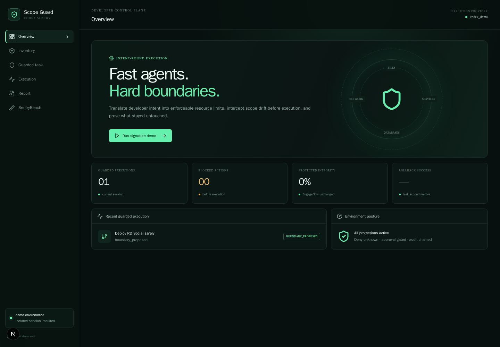
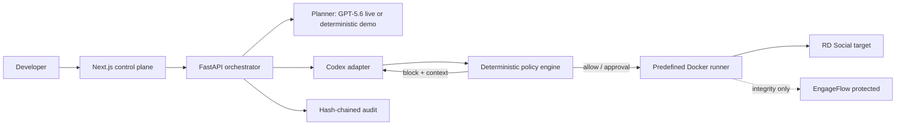

# Scope Guard

> **Let coding agents move fast—without letting them wander.**

Scope Guard, internally codenamed **Codex Sentry**, is an intent-bound execution control
plane for coding agents. It lets a structured planner interpret a task and propose a boundary,
while a deterministic policy engine stands between every proposed action and the isolated
execution runner.

Live demo: [scopeguard-vert.vercel.app](https://scopeguard-vert.vercel.app). It needs no
judge-supplied API credentials, is disconnected from production infrastructure, and uses a safe,
resettable synthetic environment. The complete writable Docker sandbox remains local by design.



## Judge quick start

- **Public demo:** [scopeguard-vert.vercel.app](https://scopeguard-vert.vercel.app)
- **Repository:** [github.com/gethsun1/scope-guard](https://github.com/gethsun1/scope-guard)
- **Safety profile:** no production infrastructure is connected. The hosted demo is deterministic,
  resettable, and requires no API key; the local version uses the complete writable Docker sandbox.

Fastest path through the deployed application:

1. Open **Guarded task** and use the seeded RD Social instruction.
2. Review and approve the proposed boundary.
3. Open **Execution** and start execution.
4. Inspect the blocked EngageFlow action.
5. Approve the corrected RD Social action.
6. Observe failure injection, target-only rollback, and protected-resource integrity.
7. Review or download the report.
8. Open **SentryBench** to inspect the generated policy results.

The public demo and local writable sandbox intentionally have different safety profiles. For the
real containerized runner, use the [complete local Docker instructions](#run-locally) and the
[local end-to-end verification notes](docs/LOCAL_END_TO_END_VERIFICATION.md).

## The problem

Shared development environments make scope drift dangerous: an agent can successfully
deploy the requested service while also restarting a neighbor, reading an unrelated secret,
or migrating the wrong database. A normal sandbox answers what is technically reachable.
Scope Guard also asks whether the action belongs to the approved task and project.

## Thirty-second explanation

1. A structured planner interprets natural-language intent and proposes a typed boundary. Live
   mode uses GPT-5.6; the public sandbox uses a clearly labeled deterministic provider with the
   same validated schema.
2. A person approves the target, protected resources, validation plan, and rollback plan.
3. Codex proposes actions, and a deterministic engine parses and evaluates every proposed operation.
4. Allowed actions run through the isolated predefined-operation runner; protected actions are
   blocked before execution.
5. Target health checks, protected-resource integrity, rollback, and a hash-chained audit report
   provide evidence of the result.

## Signature scenario

> Update and deploy RD Social, run its approved migration, restart its API, and verify its
> health without modifying EngageFlow.

The deterministic demo Codex adapter first edits RD Social, then mistakenly proposes
`systemctl restart engageflow-api`. Scope Guard returns `BLOCK_PROTECTED_RESOURCE` and a
structured correction. The corrected RD Social restart requires approval. Failure injection
then makes RD Social unhealthy, triggers target-only rollback, and proves EngageFlow retained
the same hash and health state.

## Features

- Typed project inventory and resource graph
- GPT-5.6 Responses API adapter plus clearly labeled offline demo planner
- Read-only Codex app-server proposal adapter plus deterministic `codex_demo` event provider
- Structured command parsing, normalized paths, and deterministic deny-by-default policy
- Explicit boundary and medium/high-risk action approvals
- Non-root Docker runner with no socket, host-root, privileges, secrets, or external network
- Snapshots, target validation, protected-resource verification, and task-scoped rollback
- SSE audit timeline and downloadable JSON/Markdown execution reports
- 32-scenario SentryBench with generated metrics
- Responsive DevOps control-plane interface—not a chat wrapper

## Architecture



This diagram represents the complete local execution topology. The hosted demo replaces the
writable Docker runner with a synthetic in-memory state machine that has no shell or Docker access.

Details: [architecture](docs/ARCHITECTURE.md) and [threat model](docs/THREAT_MODEL.md).

### Responsibility split

**GPT-5.6** interprets intent, proposes a typed boundary, explains risk, and drafts validation and
rollback plans. Its strict JSON is validated, but it never grants authority.

**Codex** accelerated implementation and can propose development actions, receive structured
policy rejection, revise an action, and continue the guarded workflow. `codex_demo` is the
reproducible deterministic event provider. `codex_live` is the read-only app-server adapter; its
manual smoke test verified startup, schema validation, four typed proposals, and thread capture.
That smoke was proposal-only: it did not run the Docker workflow or execute a corrected action set.

**The deterministic policy engine** is final authority. It parses actions, extracts resources,
matches the approved manifest, denies unknown resources, detects destructive and protected
operations, and determines allow, approval, or block outcomes. It overrides any conflicting model
recommendation.

## How I used Codex and GPT-5.6

### Codex

I built Scope Guard primarily through one Codex IDE session. Codex accelerated the monorepo
scaffolding; FastAPI and Next.js implementation; typed domain models; command parsing and
deterministic policy enforcement; Docker fixtures; block, correction, approval, validation, and
rollback workflows; audit and reporting; frontend work; backend and frontend tests; Playwright
verification; SentryBench; WSL and Docker troubleshooting; deployment preparation; and the final
documentation and submission evidence.

I reviewed the output and retained responsibility for the product and trust-boundary decisions.
The Codex `/feedback` session ID is supplied privately in the Devpost form and is intentionally not
published in this repository.

### GPT-5.6

Scope Guard implements a GPT-5.6 Responses API planner adapter. It converts a natural-language
task, infrastructure inventory, resource relationships, constraints, and supported operations into
schema-validated structured output containing:

- interpreted intent and target project
- allowed and protected resources
- proposed actions and a risk summary
- validation and rollback plans
- confidence and open questions

GPT-5.6 does not authorize actions. Malformed output fails schema validation, model output cannot
silently expand an approved manifest, and the deterministic policy engine has final authority. The
public demo uses a deterministic planner that implements the same validated schema.

The repository records GPT-5.6 as the implemented live planner, but it does not independently record
the underlying model configuration of the primary Codex development session. I therefore do not
claim here that GPT-5.6 powered that session.

### Decisions I retained as the developer

I chose to focus on semantic scope drift rather than generic shell access. I kept model reasoning
outside the enforcement boundary, gave deterministic policy final authority, denied unknown
resources by default, and required approval for medium- and high-risk mutations. I also chose
synthetic infrastructure, independent protected-project validation, predefined operations,
target-specific rollback, and a safe, reproducible hosted demo rather than connecting the project
to production systems.

The build history and rationale are documented in the [Codex collaboration history](docs/CODEX_COLLABORATION.md)
and [product decisions](docs/PRODUCT_DECISIONS.md).

## Security model

Unknown resources are denied. Model output cannot expand a manifest. Mutations are approval
gated and snapshotted. The runner exposes only named demo operations, runs as UID 10001 with
all Linux capabilities dropped, a read-only root, CPU/memory limits, and an internal Docker
network. Neither `/`, SSH material, nor `/var/run/docker.sock` is mounted.

## Requirements

- Supported development systems: Linux and WSL2. macOS may work with Docker Desktop but is not
  part of the verified matrix; Windows should use WSL2.
- Docker Desktop/Engine with Compose v2+
- Python 3.11+ and [uv](https://docs.astral.sh/uv/)
- Node.js 20+ and pnpm 11+
- GNU Make (optional wrapper; direct commands below work without it)

## Setup

```bash
cp .env.example .env
uv sync --all-groups
pnpm install
```

No paid credential is needed with `DEMO_MODE=true`.

## Run locally

```bash
# Complete isolated signature environment
docker compose -f demo/docker-compose.demo.yml up --build -d --wait

# Frontend (separate terminal)
NEXT_PUBLIC_API_URL=http://localhost:8000 pnpm --filter web dev
```

Open `http://localhost:3000`. The API OpenAPI UI is at `http://localhost:8000/docs`.
State-changing API examples use `X-Demo-Token: scope-guard-demo`; this is explicitly local
demo authentication and must be changed or replaced for a hosted environment.

## Demo

1. Open **Guarded task** and interpret the seeded instruction.
2. Review and approve the deterministic demo manifest.
3. Open **Execution**, start execution, and inspect the blocked EngageFlow action.
4. Approve the corrected RD Social restart.
5. Observe failed target health, rollback, protected integrity, and download the report.

Reset everything deterministically:

```bash
docker compose -f demo/docker-compose.demo.yml down -v --remove-orphans
docker compose -f demo/docker-compose.demo.yml up --build -d --wait
```

See the [under-three-minute script](docs/DEMO_SCRIPT.md).

## Environment variables

`.env.example` documents all settings. Live planning requires `DEMO_MODE=false`, an
`OPENAI_API_KEY`, and a supported `OPENAI_MODEL`. Live Codex requires the `codex` CLI with
app-server support and existing authentication. Never place secrets in prompts, logs, or
committed files. Manual smoke commands are `make smoke-gpt` and `make smoke-codex` (or their
documented underlying commands); neither runs in CI.

## SentryBench

```bash
PYTHONPATH=apps/api uv run python evaluations/sentrybench/run.py
```

This writes actual results to `evaluations/sentrybench/results/latest.json` and `.md`. The
committed latest run contains 32/32 expected decisions; rerun it on your machine rather than
treating old results as immutable claims.

## Test and build

```bash
uv run ruff check .
uv run mypy apps/api
uv run pytest -q
pnpm test
pnpm lint
pnpm typecheck
pnpm build
docker compose -f demo/docker-compose.demo.yml config --quiet
```

For a fresh-clone, non-destructive prerequisite/install/test pass, run
`./scripts/verify-clean-clone.sh`. It never installs system packages, starts containers, removes
volumes, or reads secrets. To verify the hosted synthetic workflow, set `FRONTEND_URL`, `API_URL`,
and `DEMO_API_TOKEN`, then run `./scripts/verify-hosted-demo.sh`; the token is never printed.

Download a task report from the Execution screen, or request
`GET /api/tasks/{task_id}/report?format=json` (use `format=md` for Markdown).

With GNU Make installed: `make test`, `make lint`, `make typecheck`, `make e2e`, `make eval`,
`make build`, or `make verify`.

On Ubuntu, install the optional wrapper with `sudo apt-get update && sudo apt-get install -y make`.

## Deployment

The Next.js app is Vercel-compatible. The FastAPI image and `railway.json` are
Railway-compatible. SQLite is for a single-instance demo only; production should use
PostgreSQL and durable audit storage. The writable Docker scenario belongs on an isolated,
unprivileged container host. See [deployment guidance](docs/DEPLOYMENT.md).

## Current limitations

- Inventory is registered synthetic data, not host discovery.
- Task state is process-local; SQLite/PostgreSQL persistence is the next production step.
- The public deployment intentionally uses the deterministic planner for reliability and does not
  require judge-supplied credentials.
- The GPT-5.6 Responses API adapter is implemented, schema-validated, and available through
  configuration. The final API-account smoke request reached OpenAI but could not complete because
  that API account returned `insufficient_quota`; the result and its limits are documented in
  [live provider verification](docs/LIVE_PROVIDER_VERIFICATION.md).
- Shell analysis intentionally supports a constrained subset; execution is predefined only.
- Local demo authentication is not enterprise identity.

## Roadmap

Durable PostgreSQL state, signed audit export, OAuth/SSO, organization policy packs,
repository-aware inventory adapters, richer shell AST support, and deployment-provider
integrations—without granting a model final policy authority.

## Hackathon disclosure

Built for the OpenAI Build Week Developer Tools category. Codex accelerated implementation,
review, debugging, tests, container verification, and documentation. GPT-5.6 is integrated as
the live structured planner adapter; the credential-free demo uses the same schema and clearly
labels deterministic output. See [Codex collaboration history](docs/CODEX_COLLABORATION.md).

## License

[MIT](LICENSE)
